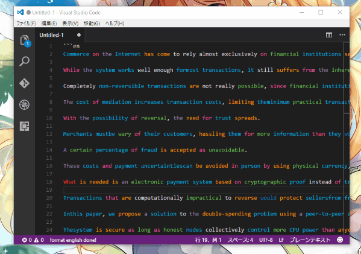

# EnDocReader

EnDocReaderは**英語のドキュメントの精読をサポート**するVisualStudio CodeのExtensionです

VS Codeでレッツ英論ライフ！

## Install

VS CodeのExtensionから**endocreader**と検索、インストール、有効化してください

Windowsの場合は現在CRLF改行コードには対応していないのでステータスバーから**LF改行コード**に変更してください

## Usage

精読したい英文をVS Codeにコピー&ペーストし、<code>\`\`\`en</code>と<code>\`\`\`</code>で囲みます

\`\`\`en

This is sample sentence.

\`\`\`

英文を囲んだら<code>Ctrl+Shift+P</code>でコマンド入力画面を立ち上げ、<code>en:</code>と入力することでコマンド一覧を表示し、使いたいコマンドを選択します

## Format Sentence

英文1文の中に入っている不正な改行や文末が改行されていないような英文をすべて1文にフォーマットし直します

書く文の下には空白行が必ず入るので訳を書くことができます

使い方はコマンド入力画面で<code>format line</code>と入力します

## Part Of Speech Coloring

英文の品詞解析を行い、品詞ごとに色分けします

どの色がどの品詞かは単語にマウスカーソルを当てるとポップアップとして表示されます

トグル機能なのでもう一度コマンドを使えば色は元に戻ります

使い方はコマンド入力画面で<code>toggle coloring</code>と入力します

## Inner Translate

選択した単語及び英文を翻訳し、翻訳結果を英文の下に自動記述します

翻訳エンジンはBing Translatorなのでインターネット環境が必須です

使い方は翻訳したいテキストを選択した状態でコマンド入力画面に行き、<code>inner translate</code>と入力します

## Google Translate

選択した単語及び英文をGoogle翻訳を使って翻訳します

ただしInner Translateと違い、エディタ内に翻訳結果の記載はしません

コマンドを実行すると外部ブラウザが立ち上がり、Google翻訳のページで結果を確認できます

使い方は翻訳したいテキストを選択した状態でコマンド入力画面に行き、<code>google translate</code>と入力します

## ご要望
Issueやpull requestしてくれると喜びます

[@garicchi](http://twitter.com/garicchi)にリプライでも可

## License

MIT

## Contribution

元ネタは[drilldripper氏](https://github.com/drilldripper)のChrome拡張である[ColorPosTagger](https://github.com/drilldripper/ColorPosTagger)です

品詞解析のコードをいくらか引用しています

### npm パッケージ
- 品詞解析エンジン: [pos](https://www.npmjs.com/package/pos)
- Bing Translatorクライアント: [bing-translate](https://www.npmjs.com/package/bing-translate)

