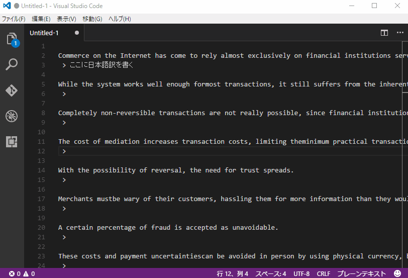

# EnDocReader

EnDocReaderは**英語のドキュメントの精読をサポート**するVisualStudio CodeのExtensionです

VS Codeでレッツ英論ライフ！

## Install

VS CodeのExtensionから**endocreader**と検索、インストール、有効化してください

## Usage

精読したい英文をコピペして右クリックのコンテキストメニューから実行したいコマンドを選択します

また、<code>Ctrl+Shift+P</code>でコマンド入力画面を立ち上げ、<code>en:</code>と入力することでコマンド一覧を表示し、実行することもできます

## Format Sentence

英文1文の中に入っている不正な改行や文末が改行されていないような英文をすべて1文にフォーマットし直します

書く文の下には空白行が必ず入るので訳を書くことができます

使い方はフォーマットしたい英文を選択し、右クリックから<code>en: Format Line</code>を選択します

## Part Of Speech Coloring

英文の品詞解析を行い、品詞ごとに色分けします

どの色がどの品詞かは単語にマウスカーソルを当てるとポップアップとして表示されます

トグル機能なのでもう一度コマンドを使えば色は元に戻ります

どの品詞がどの色かは[posData.json](https://github.com/garicchi/EnDocReader/blob/master/posData.json)をみてください

使い方は右クリックから<code>en: Toggle Coloring</code>と入力します

## Inner Translate

選択した単語及び英文を翻訳し、翻訳結果を英文の下に自動記述します

翻訳エンジンはBing Translatorなのでインターネット環境が必須です

使い方は翻訳したいテキストを選択した状態で右クリックから、<code>en: Inner Translate</code>を選択します

## Weblio Translate

選択した単語及び英文をWeblioで翻訳します

Weblioの場合はエディタの右側に翻訳ページがでます　インターネット環境必須です

使い方は翻訳したいテキストを選択した状態で右クリックから、<code>en: Weblio Translate</code>を選択します

## Google Translate

選択した単語及び英文をGoogle翻訳を使って翻訳します

ただしInner Translateと違い、エディタ内に翻訳結果の記載はしません

コマンドを実行すると外部ブラウザが立ち上がり、Google翻訳のページで結果を確認できます

使い方は翻訳したいテキストを選択した状態で右クリックから<code>en: Google Translate</code>を選択します

## Japanese Folding

翻訳行の表示を切り替えます

使い方は右クリックから、<code>en: Toggle Folding of Japanese</code>を選択します

## ご要望
Issueやpull requestしてくれると喜びます

[@garicchi](http://twitter.com/garicchi)にリプライでも可

## License

MIT

## Contribution

元ネタは[drilldripper氏](https://github.com/drilldripper)のChrome拡張である[ColorPosTagger](https://github.com/drilldripper/ColorPosTagger)です

品詞解析のコードをいくらか引用しています

### npm パッケージ
- 品詞解析エンジン: [pos](https://www.npmjs.com/package/pos)
- Bing Translatorクライアント: [bing-translate](https://www.npmjs.com/package/bing-translate)

